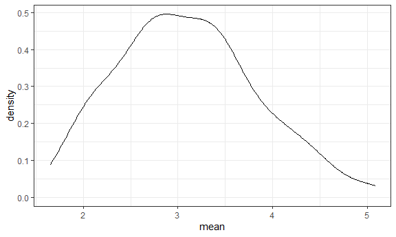
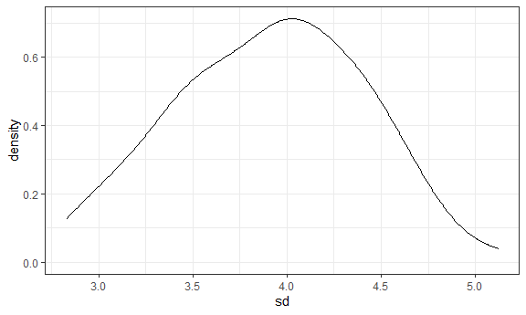
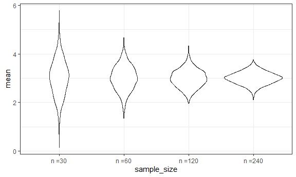

simulations
================

## Let’s simulate something

``` r
sim_mean_sd = function(samp_size, mu = 3, sigma = 4) {
  
  sim_data = 
    tibble(
      x = rnorm(n = samp_size, mean = mu, sd = sigma)
    )

sim_data %>% 
  summarize(
    mean = mean(x),
    sd = sd(x)
  )

  }
```

``` r
sim_mean_sd(30)
```

    ## # A tibble: 1 × 2
    ##    mean    sd
    ##   <dbl> <dbl>
    ## 1  2.52  4.36

## Let’s simulate a lot

lets start with a for loop

``` r
output = vector("list", length = 100)

for (i in 1:100) {
  
  output[[i]] = sim_mean_sd(samp_size = 30)
}

bind_rows(output)
```

    ## # A tibble: 100 × 2
    ##     mean    sd
    ##    <dbl> <dbl>
    ##  1  2.65  4.40
    ##  2  3.84  3.49
    ##  3  1.84  4.11
    ##  4  3.10  3.89
    ##  5  2.31  4.16
    ##  6  2.73  3.85
    ##  7  2.33  3.63
    ##  8  2.67  4.21
    ##  9  3.28  3.45
    ## 10  1.86  4.37
    ## # … with 90 more rows
    ## # ℹ Use `print(n = ...)` to see more rows

Let’s use a loop function

``` r
sim_results =
rerun(100, sim_mean_sd(samp_size = 30)) %>% 
  bind_rows()
```

Let’s look at results..

``` r
sim_results %>% 
  ggplot(aes(x = mean)) + geom_density() 
```



``` r
sim_results %>% 
  summarize(
    avg_samp_mean = mean(mean),
    sd_samp_mean = sd(mean)
  )
```

    ## # A tibble: 1 × 2
    ##   avg_samp_mean sd_samp_mean
    ##           <dbl>        <dbl>
    ## 1          3.09        0.736

``` r
sim_results %>% 
  ggplot(aes(x = sd)) + geom_density() 
```



## Let’s try other sample sizes

``` r
n_list  =
  list(
    "n = 30" = 30,
    "n = 60" = 60,
    "n = 120" = 120,
    "n = 240" = 240
  )

output = vector("list", length = 4)

output[[1]] = rerun(100, sim_mean_sd(samp_size = n_list[[1]])) %>% bind_rows()

for (i in 1:4) {

  output[[i]] = 
    rerun(100, sim_mean_sd(samp_size = n_list[[i]])) %>%
    bind_rows()

}
```

``` r
sim_results = 
  tibble(
  sample_size = c(30, 60, 120, 240)
    
) %>% 
  mutate(
    output_lists = map(.x = sample_size, ~ rerun(1000, sim_mean_sd(.x))),
    estimate_df = map(output_lists, bind_rows)
  ) %>%
  select(-output_lists) %>% 
  unnest(estimate_df)
```

Do some df things

``` r
sim_results %>%
  mutate(
    sample_size = str_c("n =", sample_size),
    sample_size = fct_inorder(sample_size)
  ) %>% 
  ggplot(aes(x = sample_size, y = mean)) +
  geom_violin()
```



``` r
sim_results %>% 
  group_by(sample_size) %>% 
  summarize(
    avg_samp_mean = mean(mean),
    sd_samp_mean = sd(mean)
  )
```

    ## # A tibble: 4 × 3
    ##   sample_size avg_samp_mean sd_samp_mean
    ##         <dbl>         <dbl>        <dbl>
    ## 1          30          3.01        0.741
    ## 2          60          3.00        0.521
    ## 3         120          2.98        0.369
    ## 4         240          3.00        0.255
